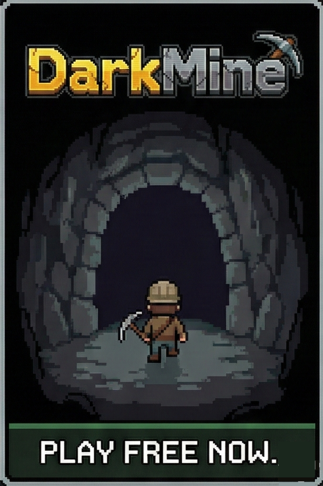

<div align="center">



# 🎮 DARKMINE

**A blockchain-powered 2D mining roguelike on Solana**

*Darkness + Randomness + Permanent Progression*

[](https://explorer.solana.com/address/6u8zV7yYbDZg38eUabnwL6ghkghwFwZv7CHrZnh6xnxM?cluster=devnet)
[](https://www.anchor-lang.com/)
[](https://react.dev/)

</div>

---

## 🌟 Overview

**DarkMine** is a 2D, top-down mining roguelike inspired by classic Pokémon dungeon visuals, built on the Solana blockchain. You start in a pitch-black mine where most tiles are hidden. Every swing of your pickaxe is a gamble — ore, diamonds, traps, or nothing. Your runs are recorded on-chain, creating a permanent leaderboard of the greatest miners.

<div align="center">

<p><i>Navigate the darkness, mine resources, and battle enemies in this roguelike adventure</i></p>
</div>

### Core Gameplay

- **Darkness & Discovery**: Most of the mine is hidden. Mine blindly or find rare light sources to reveal nearby tiles
- **Resource Management**: Balance health, energy, and resources. Every action costs energy — run out, and you're done
- **Combat**: Face dangerous Gloom Bats lurking in the darkness. Fight or flee strategically
- **Permadeath**: Each run ends when health or energy hits zero. Your score and stats are saved on-chain

### 🎯 Core Hook

**Every swing could make you richer, stronger — or dead.**

---

## 🎮 Gameplay Features

### Resources
- **Coal** ⚫: Common resource, provides energy when collected
- **Ore** 🟤: Valuable crafting material, boosts your score
- **Diamonds** 💎: Rarest resource found in high-risk zones, can be minted as SPL tokens
- **Light Sources** 💡: Reveal surrounding tiles temporarily

### Progression
- **Mining Power**: Increases mining efficiency
- **Vision Range**: Expands your sight radius in the darkness
- **Health & Energy**: Manage carefully to survive longer runs

### Powers
- **Mega Mine** ⛏️: Mine in a 3x3 area around you (costs 5 energy)
- **Illuminate** 🔦: Permanently reveal all tiles in your vision range (costs 3 energy)

### Combat
- **Gloom Bats** 🦇: Enemy creatures with 30 HP, deal 10 damage
- **Player Attack**: Deal 15 damage per strike, costs 3 energy
- **Reward**: Defeating enemies grants +100 score

---

## 🔗 Blockchain Integration

### Solana Smart Contract Features

**Program ID**: `6u8zV7yYbDZg38eUabnwL6ghkghwFwZv7CHrZnh6xnxM` (Devnet)

1. **Player Accounts**
   - PDA-based player profiles
   - Track total games played, high scores, and lifetime statistics
   - Custom player names

2. **Game Result Submission**
   - Automatically submit scores, resources collected, and enemies defeated
   - Tamper-proof on-chain records

3. **Global Leaderboard**
   - Top 20 scores stored on-chain
   - Real-time competitive rankings

4. **Diamond Token Minting**
   - Convert in-game diamonds to SPL tokens
   - Claimable based on unclaimed diamond count

5. **On-Chain Events**
   - `GameCompleted` event emitted for each game
   - Indexable for analytics and achievements

---

## 🏗️ Technology Stack

### Frontend
- **Framework**: React 19.2.4 + TypeScript
- **Build Tool**: Vite 6.2.0
- **Wallet Integration**: Solana Wallet Adapter (Phantom, Solflare, etc.)
- **Styling**: Tailwind CSS (inline)
- **State Management**: React Hooks

### Smart Contracts
- **Framework**: Anchor 0.32.1
- **Language**: Rust (Edition 2021)
- **Token Standard**: SPL Token (anchor-spl)
- **Network**: Solana Devnet

### Key Dependencies
```json
{
  "@coral-xyz/anchor": "^0.32.1",
  "@solana/wallet-adapter-react": "^0.15.39",
  "@solana/wallet-adapter-wallets": "^0.19.37",
  "@solana/web3.js": "^1.98.4"
}
```

---

## 🚀 Getting Started

### Prerequisites
- Node.js (v16 or higher)
- Rust & Cargo
- Solana CLI
- Anchor CLI (v0.32.1)
- Phantom Wallet or compatible Solana wallet

### 1. Clone the Repository
```bash
git clone <repository-url>
cd solana_ai_hack
```

### 2. Smart Contract Setup

```bash
cd contracts

# Build the program
anchor build

# Run tests (optional)
anchor test

# Deploy to devnet
anchor deploy --provider.cluster devnet
```

The program is already deployed to devnet at:
- **Program ID**: `6u8zV7yYbDZg38eUabnwL6ghkghwFwZv7CHrZnh6xnxM`
- **Explorer**: [View on Solana Explorer](https://explorer.solana.com/address/6u8zV7yYbDZg38eUabnwL6ghkghwFwZv7CHrZnh6xnxM?cluster=devnet)

### 3. Frontend Setup

```bash
cd frontend

# Install dependencies
npm install

# Start development server
npm run dev
```

The app will be available at `http://localhost:5173`

### 4. Configure Your Wallet

1. Install [Phantom Wallet](https://phantom.app/)
2. Switch network to **Devnet**:
   - Settings → Developer Settings → Change Network → Devnet
3. Get devnet SOL:
   ```bash
   solana airdrop 2 <YOUR_WALLET_ADDRESS> --url devnet
   ```

### 5. Play!

- Visit `http://localhost:5173`
- Connect your wallet
- Start mining!
- Your scores will be automatically saved on-chain

---

## 🎯 How to Play

### Controls
- **Arrow Keys** or **WASD**: Move in 4 directions
- **Mine**: Move into a rock tile to mine it
- **Attack**: Move into an enemy to attack
- **Powers**: Click power buttons in the HUD

### Tips
- 🔋 **Manage Energy**: Mining costs 2 energy, moving costs 1, attacking costs 3
- 👀 **Expand Vision**: Collect light sources to see further
- 💎 **High Risk, High Reward**: Diamonds are rare but valuable
- ⚡ **Use Powers Wisely**: Mega Mine and Illuminate are powerful but costly
- 🦇 **Combat Strategy**: Only fight when necessary, enemies deal significant damage

### Scoring System
- **Coal**: +10 points
- **Ore**: +25 points
- **Diamond**: +100 points
- **Enemy Defeated**: +100 points
- **Trap**: -20 points
- **Light Source**: +15 points

---

## 📁 Project Structure

```
solana_ai_hack/
├── contracts/                    # Anchor smart contracts
│   ├── programs/contracts/
│   │   └── src/
│   │       ├── lib.rs           # Main program logic
│   │       └── initialize.rs    # Initialization helpers
│   ├── Anchor.toml              # Anchor configuration
│   └── target/
│       ├── deploy/              # Compiled program (.so)
│       └── idl/                 # Generated IDL
│
├── frontend/                     # React frontend
│   ├── components/              # React components
│   │   ├── Game.tsx            # Main game component
│   │   ├── GameOverScreen.tsx  # Game over + blockchain submission
│   │   ├── SolanaProvider.tsx  # Wallet adapter provider
│   │   └── ...
│   ├── hooks/                   # Custom React hooks
│   │   ├── useGameLogic.ts     # Core game logic
│   │   ├── useGameContract.ts  # Smart contract interactions
│   │   └── useAnchorProgram.ts # Anchor program connection
│   ├── assets/                  # Game sprites and images
│   ├── constants.ts            # Game configuration
│   ├── types.ts                # TypeScript types
│   └── darkmine_contract.json  # Program IDL
│
├── DEPLOYMENT.md                # Deployment guide
└── README.md                    # This file
```

---

## 🔐 Smart Contract Architecture

### Accounts

**PlayerAccount** (PDA: `["player", player_pubkey]`)
```rust
{
  player: Pubkey,
  name: String,
  games_played: u64,
  total_score: u64,
  high_score: u64,
  total_coal: u64,
  total_ore: u64,
  total_diamonds: u64,
  diamonds_claimed: u64,
  total_enemies_defeated: u64,
  joined_timestamp: i64,
  last_game_timestamp: i64,
}
```

**Leaderboard** (PDA: `["leaderboard"]`)
```rust
{
  top_scores: [ScoreEntry; 20],
  count: u32,
}
```

### Instructions

1. `initialize_player()` - Create player account (one-time)
2. `submit_game_result(score, coal, ore, diamonds, enemies)` - Record game stats
3. `initialize_leaderboard()` - Setup leaderboard (admin only)
4. `mint_diamond_tokens(amount)` - Claim diamond SPL tokens
5. `set_player_name(name)` - Update player display name

### Events

- `GameCompleted` - Emitted after each game with full statistics

---

## 🎨 Game Economy

### In-Game Resources
- **Coal** ⚫: Energy restoration, common drops
- **Ore** 🟤: Crafting material, moderate value
- **Diamonds** 💎: Rare, convertible to SPL tokens

### Token Economy (Future)
- **Diamond SPL Tokens**: Mintable from in-game diamonds
- **Permanent Upgrades**: Start with better stats
- **Cosmetics**: Custom player skins and effects
- **Mine Access**: Unlock deeper, more dangerous zones

---

## 🔮 Future Roadmap

### Phase 1: Core Enhancements ✅
- [x] Blockchain integration
- [x] Player accounts and leaderboard
- [x] Diamond token minting
- [ ] Enhanced UI/UX with animations

### Phase 2: Advanced Features
- [ ] Multiplayer zones (collaborate or compete)
- [ ] Deeper mine levels with increasing difficulty
- [ ] Boss enemies and special events
- [ ] Achievement system with NFT badges
- [ ] Trading marketplace for resources

### Phase 3: DAO & Governance
- [ ] Community-voted mine themes
- [ ] Player-created custom challenges
- [ ] Tournament system with prize pools
- [ ] Governance token for game decisions

### Phase 4: Mobile & Scaling
- [ ] Mobile app (iOS/Android)
- [ ] L2 integration for lower costs
- [ ] Cross-chain support
- [ ] Esports integration

---

## 🧪 Testing

### Run Smart Contract Tests
```bash
cd contracts
anchor test
```

### Build Frontend
```bash
cd frontend
npm run build
```

### Type Checking
```bash
cd frontend
npx tsc --noEmit
```

---

## 📊 Deployment Information

### Devnet Deployment
- **Network**: Solana Devnet
- **Program ID**: `6u8zV7yYbDZg38eUabnwL6ghkghwFwZv7CHrZnh6xnxM`
- **Deployment TX**: `4xhiD5zYvCbj6DHUVKPuMJZrwGENLTb5sYLDAkwyZFKhuzgw6Aag2AAmJJqzEADvtBXeszc3S11jgVzPeSXhjk2m`
- **RPC**: `https://api.devnet.solana.com`

### View on Explorer
- [Program Account](https://explorer.solana.com/address/6u8zV7yYbDZg38eUabnwL6ghkghwFwZv7CHrZnh6xnxM?cluster=devnet)
- View transactions and program events in real-time

---

## 🤝 Contributing

Contributions are welcome! Please follow these steps:

1. Fork the repository
2. Create a feature branch (`git checkout -b feature/amazing-feature`)
3. Commit your changes (`git commit -m 'Add amazing feature'`)
4. Push to the branch (`git push origin feature/amazing-feature`)
5. Open a Pull Request

---

## 📝 License

This project is licensed under the MIT License.

---

## 🙏 Acknowledgments

- Inspired by classic Pokémon Mystery Dungeon visuals
- Built with [Anchor Framework](https://www.anchor-lang.com/)
- Powered by [Solana](https://solana.com/)
- Wallet integration via [Solana Wallet Adapter](https://github.com/solana-labs/wallet-adapter)

---

## 📧 Support

- **Issues**: [GitHub Issues](https://github.com/sushmitsarmah/darkmine_solana/issues)
- **Discord**: [Join our community](#)
- **Twitter**: [@DarkMineGame](#)

---

<div align="center">

**Happy Mining! ⛏️💎**

*Every swing could make you richer, stronger — or dead.*

</div>
